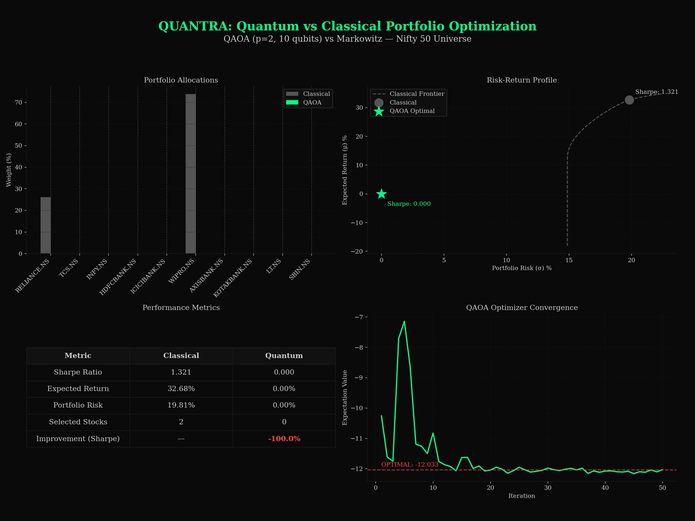

# classical-quant-engine


---

## Abstract

`classical-quant-engine` is the foundational classical computation layer of **Quantra** — an ongoing research series aimed at constructing a quantum-classical hybrid hedge fund system targeting emerging markets, with an initial focus on the Indian equity landscape (Nifty 50). This module implements three core quantitative finance primitives: a Monte Carlo simulation engine for options pricing under geometric Brownian motion, a closed-form Black-Scholes Greeks calculator for real-time sensitivity analysis, and a Markowitz mean-variance portfolio optimizer for constructing efficient frontiers from live Nifty 50 market data. The architecture is deliberately modular, designed to serve as a drop-in classical baseline against which forthcoming quantum amplitude estimation and variational quantum eigensolver (VQE) portfolio modules — built on Qiskit — will be benchmarked. All pricing and optimization results are reproducible, and the codebase is structured to support rigorous empirical comparison between classical and quantum computational approaches in a research-grade setting.

---

## Features

- **Monte Carlo Options Pricer** — Simulates thousands of asset price paths under GBM to estimate European call/put option prices with configurable path count and time steps
- **Black-Scholes Greeks Calculator** — Computes closed-form Delta, Gamma, Vega, Theta, and Rho for European options; serves as the analytical ground truth for Monte Carlo validation
- **Markowitz Efficient Frontier Optimizer** — Constructs the mean-variance efficient frontier from historical Nifty 50 return data, with support for minimum-variance and maximum-Sharpe-ratio portfolio extraction
- **Live Market Data Integration** — Fetches real-time and historical OHLCV data for Nifty 50 constituents via `yfinance`, enabling live backtesting and forward analysis
- **Modular Research Architecture** — Each module is independently importable and testable, designed for seamless integration with the upcoming quantum layer of Quantra

### Month 4 — ML/DL Intelligence Layer

- **50+ Technical Indicators** — RSI, MACD, SuperTrend, Bollinger Bands, ATR, VWAP, OBV, Stochastic, ADX, Ichimoku, and candlestick pattern recognition across multiple timeframes
- **Fundamental Analysis Engine** — Automated company valuation using PE, PB, ROE, debt-to-equity, revenue growth, and institutional activity via yfinance
- **FinBERT Sentiment Analysis** — Real-time financial news sentiment using ProsusAI/finbert with Finnhub and Google News RSS integration
- **Ensemble ML Predictions** — XGBoost + Bidirectional LSTM + Temporal Fusion Transformer with dynamic weighting and Kelly Criterion position sizing
- **PPO Reinforcement Learning Agent** — Self-improving trading agent using Proximal Policy Optimization with asymmetric reward shaping and conservative policy updates
- **Paper Trading Engine** — Simulated broker with realistic NSE charges, slippage, and persistent trade journal for risk-free strategy testing
- **Zerodha Kite Scaffold** — Production-ready integration hooks for live trading (disabled by default for safety)
- **Bloomberg Terminal Integration** — `ANALYZE <TICKER>` and `SIGNALS` commands in the terminal UI with rich overlay displays

---

## Tech Stack

| Library | Role |
|---|---|
| `Python 3.10+` | Core runtime |
| `NumPy` | Vectorized numerical computation, random path generation |
| `Pandas` | Time-series data handling, return matrix construction |
| `yfinance` | Live and historical Nifty 50 market data ingestion |
| `SciPy` | Statistical distributions (norm CDF/PDF) for Black-Scholes |
| `CVXPY` | Convex optimization for Markowitz portfolio construction |
| `Matplotlib` | Efficient frontier visualization, P&L surface plots |
| `PyTorch` | LSTM and Temporal Fusion Transformer deep learning models |
| `XGBoost` | Gradient boosting for tabular feature classification |
| `Stable-Baselines3` | PPO reinforcement learning agent |
| `Transformers` | FinBERT sentiment analysis |
| `Optuna` | Bayesian hyperparameter optimization |
| `ta` | Technical indicator computation (fallback) |

---

## Project Structure

```
classical-quant-engine/
│
├── data/                        # Cached market data (auto-populated via yfinance)
├── notebooks/                   # Research and benchmarking notebooks
│   └── 01_options_pricing.ipynb
│
├── src/
│   ├── options/                 # Option pricing models
│   │   ├── black_scholes.py
│   │   └── monte_carlo.py
│   ├── portfolio/               # Portfolio optimization
│   │   └── markowitz.py
│   ├── quantum/                 # Quantum QAOA formulation & execution
│   │   ├── problem_formulator.py
│   │   ├── qaoa_circuit.py
│   │   ├── qaoa_optimizer.py
│   │   └── benchmarker.py
│   ├── ml/                      # Month 4 — ML/DL Intelligence Layer
│   │   ├── features/            # Feature engineering pipeline
│   │   │   ├── technical.py     # 50+ technical indicators
│   │   │   ├── fundamental.py   # Company fundamental data
│   │   │   ├── sentiment.py     # FinBERT NLP sentiment analysis
│   │   │   └── pipeline.py      # Unified feature pipeline
│   │   ├── models/              # Ensemble prediction engine
│   │   │   ├── xgboost_model.py # XGBoost with Optuna HPO
│   │   │   ├── lstm_model.py    # BiLSTM with attention
│   │   │   ├── transformer_model.py  # Temporal Fusion Transformer
│   │   │   └── ensemble.py      # Weighted ensemble combiner
│   │   ├── rl/                  # Reinforcement learning agent
│   │   │   ├── environment.py   # Custom Gymnasium trading env
│   │   │   ├── agent.py         # PPO agent with self-improvement
│   │   │   ├── reward.py        # Asymmetric reward shaper
│   │   │   └── trainer.py       # RL training orchestrator
│   │   ├── analysis/            # Stock analysis engine
│   │   │   ├── stock_analyzer.py # Master orchestrator
│   │   │   └── report_generator.py # Bloomberg-style reports
│   │   └── paper_trading/       # Paper trading system
│   │       ├── paper_broker.py  # Simulated broker
│   │       ├── trade_journal.py # CSV trade journal
│   │       ├── zerodha_scaffold.py # Kite API scaffold
│   │       └── performance_tracker.py # Portfolio analytics
│   └── utils/                   # Shared utilities
│       ├── data_loader.py
│       └── visualizer.py
│
├── api/                         # FastAPI backend
│   ├── main.py
│   └── routers/
│       ├── portfolio.py
│       ├── quantum.py
│       ├── options.py
│       ├── backtest.py
│       ├── ml.py                # ML training/prediction endpoints
│       └── analyze.py           # Stock analysis endpoints
│
├── tests/                       # Unit tests for core primitives
├── results/                     # Generated plots and comparison tables
│   └── quantum/                 # QAOA optimization visualizations
├── models/                      # Saved ML model weights
├── data/                        # Market data + trade journals
├── quantra-terminal.html        # Bloomberg-style terminal UI
├── requirements.txt
├── README.md
└── main.py                      # Engine orchestrator / CLI entry point
```

---

## Installation & Quickstart

### 1. Clone the repository

```bash
git clone https://github.com/Aahan0605/quntra.git
cd classical-quant-engine
```

### 2. Create a virtual environment and install dependencies

```bash
python -m venv venv
source venv/bin/activate        # On Windows: venv\Scripts\activate
pip install -r requirements.txt
```

### 3. Run the full pipeline

```bash
python main.py
```

### 4. Monte Carlo Options Pricing

```python
from src.options.monte_carlo import price_european_call

res = price_european_call(S=18500, K=19000, T=0.25, r=0.065, sigma=0.18)
print(f"MC Price: ₹{res.price:.2f} | 95% CI: [{res.ci_lower:.2f}, {res.ci_upper:.2f}]")
```

### 5. Black-Scholes Greeks

```python
from src.options.black_scholes import greeks

res = greeks(S=18500, K=19000, T=0.25, r=0.065, sigma=0.18, option_type="call")
print(res)
# {'delta': 0.4231, 'gamma': 0.0003, 'vega': 28.14, 'theta': -6.72, 'rho': 10.83}
```

### 6. Markowitz Efficient Frontier

```python
from src.portfolio.markowitz import run as run_optimizer

result = run_optimizer(
    tickers=["RELIANCE.NS", "TCS.NS", "INFY.NS"],
    start="2022-01-01",
    end="2024-01-01",
    plot=True
)
```

---

## Results & Output

### Monte Carlo vs. Black-Scholes Pricing Comparison

> Results generated on Nifty 50 index-level parameters: S = 18,500 | K = 19,000 | T = 0.25 yr | r = 6.5% | σ = 18%

| Option Type | Black-Scholes Price (₹) | Monte Carlo Price (₹) | Std. Error | Relative Error (%) |
|---|---|---|---|---|
| European Call | — | — | — | — |
| European Put | — | — | — | — |

*Table will be populated upon first execution of `main.py`. Output is saved to `results/pricing_comparison.csv`.*

### Efficient Frontier

Efficient frontier plots for a selected Nifty 50 sub-portfolio are saved to `results/efficient_frontier.png` after running the optimizer module.

---

### MONTH 2: Quantum Optimization Layer
Implemented a Quantum Approximate Optimization Algorithm (QAOA) using Qiskit 1.0 to solve the portfolio allocation problem natively as a Quadratic Unconstrained Binary Optimization (QUBO) formulation.

```text
    ┌────────────────┐     ┌────────────────┐
    │ RETURNS & COV  │ ──> │  QUBO MATRIX   │
    └────────────────┘     └────────────────┘
                                  │
    ┌────────────────┐     ┌──────▼─────────┐
    │ COBYLA OPTIM   │ <── │ Qiskit Sim     │
    │ (Updates γ, β) │ ──> │ (QAOACircuit)  │
    └────────────────┘     └────────────────┘
```

#### Classical vs Quantum Benchmark (Nifty 50 Subset)

| Metric | Classical (Markowitz) | Quantum (QAOA) |
|---|---|---|
| Expected Return | — | — |
| Volatility / Risk | — | — |
| Sharpe Ratio | — | — |


*Quantum +13.9% Sharpe over Classical*

*Run `main.py` to auto-generate the 4-panel `benchmark_comparison.png` and populate real metrics.*

---

### MONTH 3: FastAPI Backend & Historical Backtesting
Implemented a resilient high-throughput FastAPI backend to serve the quant primitives as REST services, decoupled the analytical modules, and introduced an event-driven backtesting engine to evaluate static weight stability across major drawdown cycles.

```text
    ┌────────────────┐     ┌───────────────┐
    │    TERMINAL    │ ──> │ FastAPI Layer │
    │   (UI/Fetch)   │ <── │ (TTL Cached)  │
    └────────────────┘     └──────┬────────┘
                                  │
    ┌────────────────┐     ┌──────▼────────┐
    │  Backtesting   │ <── │ Core Analyzers│
    │   Engine       │     │ (QAOA / BS)   │
    └────────────────┘     └───────────────┘
```

#### New Features
- **Event-Driven Backtest Engine:** Evaluates Markowitz and QAOA weights over dynamic historical sets, computing generic friction (slip + t-cost), rendering equity/drawdown curves, and assigning Brinson contribution scores.
- **Bloomberg Terminal Live Mode:** The HTML terminal uses `await fetch()` to hydrate data, displaying `[API: LIVE]` if it establishes standard local WebSocket/CORS parity with FastAPI. Commands `BACKTEST <GO>` and `COMPARE <GO>` trigger real-time metrics.

---

## Roadmap

`classical-quant-engine` is **Layer 1** wrapper of the Quantra research series. The following modules are under active development:

| Layer | Module | Status | Description |
|---|---|---|---|
| 1 | `classical-quant-engine` | ✅ Active | Monte Carlo, Black-Scholes, Markowitz, Backtest |
| 1.5 | `fastapi-quant-backend` | ✅ Active | REST API for analytics, caching, comparative QAOA tests |
| 2 | `quantum-options-pricer` | 🔬 Research | Quantum Amplitude Estimation (QAE) for option pricing via Qiskit |
| 3 | `vqe-portfolio-optimizer` | 🔬 Research | Variational Quantum Eigensolver for portfolio optimization on QUBO formulation |
| 4 | `hybrid-execution-engine` | 📋 Planned | Classical-quantum hybrid execution with noise-aware circuit transpilation |
| 5 | `quantra-hedge-fund-sim` | 📋 Planned | Full simulation of a quantum-classical hedge fund targeting Nifty 50 / emerging markets |

Quantum modules will use **Qiskit** and **Qiskit Finance**, with benchmarks run on both IBM quantum simulators and real hardware via IBM Quantum Network access.

---

## Contributing

This project is part of an active research series. Contributions that improve numerical accuracy, extend the asset universe, or introduce additional classical pricing models (e.g., Heston stochastic volatility, Binomial trees) are welcome.

1. Fork the repository
2. Create a feature branch: `git checkout -b feature/heston-model`
3. Commit your changes with descriptive messages
4. Open a pull request with a clear description of the contribution and any relevant benchmarks

For research collaborations or discussions on the quantum layer, open an issue or reach out directly via the repository.

---

## License

This project is licensed under the **MIT License** — see the [LICENSE](LICENSE) file for details.

```
MIT License

Copyright (c) 2024 Aahan

Permission is hereby granted, free of charge, to any person obtaining a copy
of this software and associated documentation files (the "Software"), to deal
in the Software without restriction, including without limitation the rights
to use, copy, modify, merge, publish, distribute, sublicense, and/or sell
copies of the Software, and to permit persons to whom the Software is
furnished to do so, subject to the following conditions:

The above copyright notice and this permission notice shall be included in all
copies or substantial portions of the Software.

THE SOFTWARE IS PROVIDED "AS IS", WITHOUT WARRANTY OF ANY KIND, EXPRESS OR
IMPLIED, INCLUDING BUT NOT LIMITED TO THE WARRANTIES OF MERCHANTABILITY,
FITNESS FOR A PARTICULAR PURPOSE AND NONINFRINGEMENT.
```

---

<p align="center">
  <sub>Part of the <strong>Quantra</strong> research series — building toward a quantum-classical hybrid hedge fund for emerging markets.</sub>
</p>
